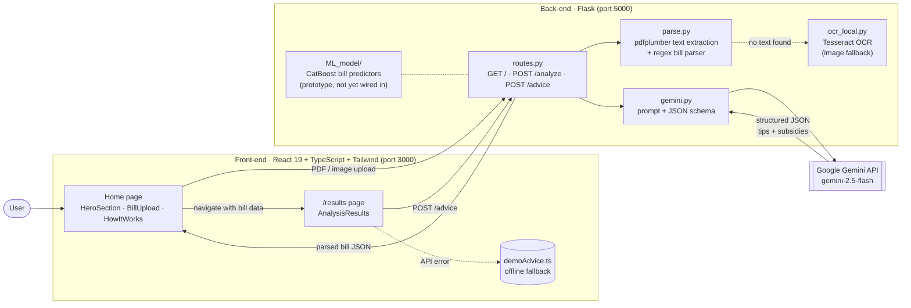
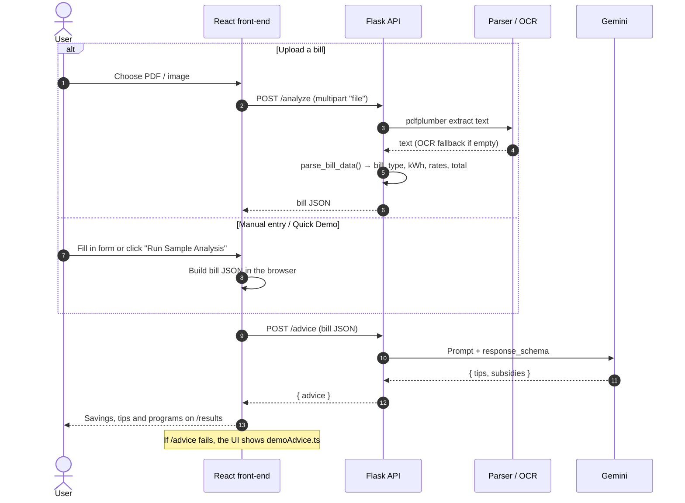

# ⚡ Save-A-Watt

Save-A-Watt helps Ontario households understand their electricity bills and lower them. Upload a bill (PDF or photo), enter it by hand, or try the built-in demo. The app works out the bill type (Time-of-Use, Tiered, or Flat/ULO) and uses Google Gemini to return:

- **Personalized savings tips**: one for your rate plan, one for your household, and one combining both
- **Estimated monthly savings** and an efficiency score
- **Ontario assistance programs** you may qualify for (e.g. OESP, LEAP)

Built at a hackathon (October 2025).

---

## 🏗️ Architecture



### Request flow

There are three ways in: **Upload**, **Manual entry**, and **Quick Demo**. All three end at `/advice`. Only uploads go through `/analyze` first.



### Key design decisions

| Decision | Why |
|---|---|
| **Structured output from Gemini** (`response_mime_type="application/json"` + `response_schema`) | The UI renders cards straight from the response, so the output has to be valid JSON with a fixed shape rather than free text. |
| **Rule-based bill parsing** (regex on keywords like `Peak`, `Tier 1`, `Total Usage`) | Ontario bills use a small set of known formats. Regex is fast, needs no model, and returns a clear error when a PDF isn't an electricity bill. |
| **OCR only as a fallback** | pdfplumber is exact for digital PDFs. Tesseract runs only when no text layer exists, for example with photos. |
| **Demo fallback on the front-end** | The UI still works during a live demo if the API key or network fails. |
| **CatBoost models kept separate** | These are regression models, trained on Tiered, TOU, and ULO data, that predict an expected bill for comparison. They were prototyped during the hackathon but aren't exposed through an endpoint yet. |

---

## 📂 Project structure

```
Save-A-Watt/
├── front-end/                    React + TypeScript + Tailwind (Create React App)
│   └── src/
│       ├── App.tsx               Routes: "/" (home) and "/results"
│       ├── components/
│       │   ├── BillUpload.tsx    Demo / Upload / Manual tabs → calls POST /analyze
│       │   ├── AnalysisResults.tsx  Calls POST /advice and renders tips + subsidies
│       │   ├── Header, HeroSection, HowItWorks, Footer
│       │   └── ui/               shadcn/ui (Radix) primitives
│       └── data/demoAdvice.ts    Offline fallback results
│
└── back-end/                     Python Flask API
    ├── app.py                    App entry point, CORS, Tesseract config
    ├── requirements.txt
    ├── .env.example              Copy to .env and add your GEMINI_API_KEY
    ├── samples/                  Sample bills for testing the upload flow
    └── src/
        ├── routes.py             /, /analyze, /advice
        ├── parse.py              PDF text extraction + bill parsing
        ├── ocr_local.py          Tesseract OCR helper
        ├── gemini.py             Gemini prompt + response schema
        └── ML_model/             CatBoost models (.cbm) + training/predict helpers
```

---

## 🔌 API reference

| Method | Endpoint | Body | Returns |
|---|---|---|---|
| `GET` | `/` | none | `{ "ok": true }` health check |
| `POST` | `/analyze` | `multipart/form-data` with `file` (PDF or image), **or** JSON `{ "file_path": "..." }` | Parsed bill, e.g. `{ "bill_type": "TOU", "Peak_kWh": 120, "OffPeak_kWh": 300, "Total_Cost": 98.4, ... }` or `{ "error": "..." }` |
| `POST` | `/advice` | Bill JSON (output of `/analyze`, or manual / demo data) | `{ "advice": { "tips": { currentUsage, currentBill, estimatedSavings, percentageSaving, efficiencyScore, tips[] }, "subsidies": [...] } }` |

---

## 🚀 Running locally

### Prerequisites

- **Node.js** 18+ and npm
- **Python** 3.10+
- A **Google Gemini API key**, free from [Google AI Studio](https://aistudio.google.com/app/apikey)
- *(Optional)* [Tesseract OCR](https://github.com/UB-Mannheim/tesseract/wiki), needed only for uploading photos or scanned bills

### 1. Back-end (terminal 1)

```bash
cd back-end
python -m venv .venv
.venv\Scripts\activate            # Windows
# source .venv/bin/activate       # macOS / Linux
pip install -r requirements.txt

copy .env.example .env            # Windows  (cp on macOS/Linux)
# then edit .env and set GEMINI_API_KEY

python app.py                     # → http://localhost:5000
```

### 2. Front-end (terminal 2)

```bash
cd front-end
npm install
npm start                         # → http://localhost:3000
```

### 3. Try it

1. Open http://localhost:3000 and scroll to the input section.
2. **Quick Demo**: click *Run Sample Analysis*.
3. **Upload Bills**: upload one of the PDFs in `back-end/samples/`.
4. **Enter Manually**: pick a month, year, and bill type, then fill in the rates and totals.

If the page shows *"Failed to fetch advice. Showing demo data."*, check that the back-end is running and that `GEMINI_API_KEY` is set.

---

## 🛠️ Tech stack

**Front-end:** React 19, TypeScript, React Router, Tailwind CSS, shadcn/ui (Radix UI), lucide-react
**Back-end:** Flask, flask-cors, pdfplumber, pytesseract + Pillow, google-generativeai, python-dotenv
**ML:** CatBoost, pandas, scikit-learn

## 🔭 Future work

- Add a `/predict` endpoint for the CatBoost models, so users can compare their bill with similar households
- Send every uploaded file to `/analyze`, not just the first one
- Add OCR for scanned PDFs (convert pages to images before running Tesseract)
- Make the API base URL configurable (it's currently hard-coded as `http://localhost:5000`)
